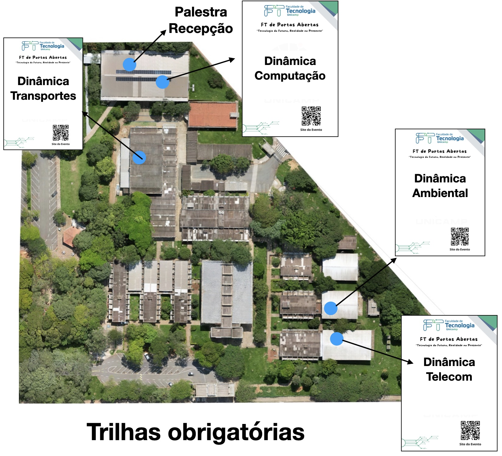

A FT de Portas Abertas 2026 foi organizada num formato parecido com o da edição de 2025. Os visitantes seguiram trilhas guiadas e pré-determinadas pela organização do evento. Essas trilhas percorriam laboratórios que realizavam dinâmicas com os visitantes sobre cada grande área da FT:  Ambiente, Computação, Telecomunicações e Transportes. Essas dinâmicas, com aproximadamente 25 min de duração cada, apresentavam detalhes dos cursos e dos trabalhos realizados em cada área da FT.

::: {.centerText}
{width=70%}
:::

::: {.centerText}
{width=70%}
:::

Além das dinâmicas de cada área, o visitante podia também participar de outras atividades distribuídas no campus (visitação livre) como o estúdio de fotos, FT em realidade virtual, estande das organizações estudantis, estúdio da [Rádio Fatídica](https://radiofatidica.ft.unicamp.br/) e também visitar diversos laboratórios de pesquisa como o [LIAG](https://liag.ft.unicamp.br/), [LMC](https://www3.ft.unicamp.br/pt-br/laboratorio/laborat%C3%B3rio-de-matem%C3%A1tica-concreta-lmc), [Lascado](https://cluster.ft.unicamp.br/), [LHI](https://linktr.ee/lhi.unicamp), [LAEG](https://wordpress.ft.unicamp.br/laeg/) e [LIEL](https://www3.ft.unicamp.br/pt-br/laboratorio/laborat%C3%B3rio-de-instrumenta%C3%A7%C3%A3o-eletr%C3%B4nica-labiel).