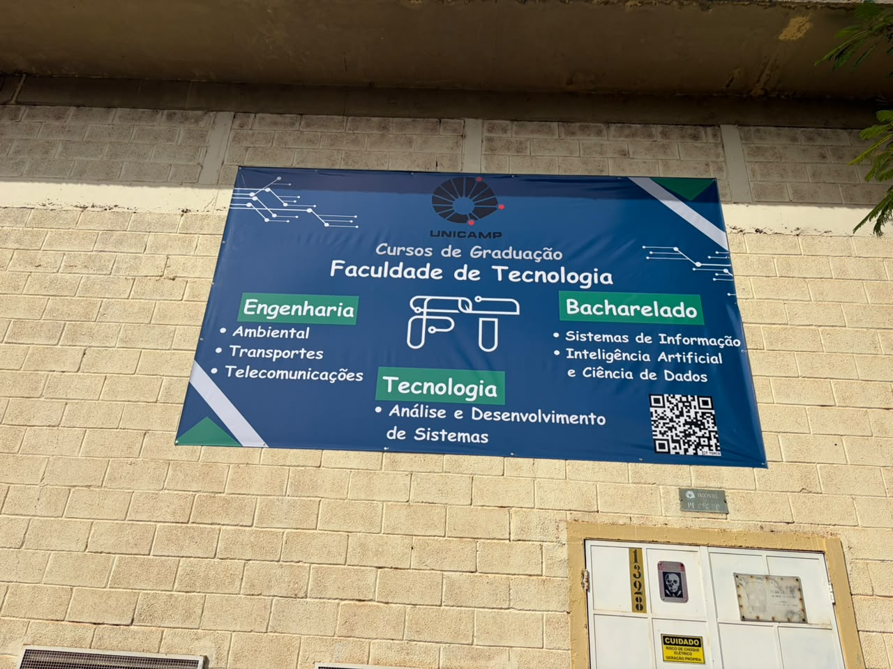

A comissão organizadora tinha disponível **R$ 12.400,00** para a execução do FTPA 2026. Esse valor era o saldo do recurso disponibilizado pela Pró-reitoria de Graduação para a realização da edição 2025. 

Foi utilizado um total de R$ 11.878,80 para confeccionar camisetas para equipe organizadora e de suporte, contratar serviços gráficos, pagar diárias para monitores, confeccionar placa de lona para divulgação dos cursos da FT e pagar 4 agentes de segurança adicional para o campus no dia do evento. Dessa forma, o saldo disponível para a edição de 2027 foi de R$ 521,20.

| Item  | Valor (R$)  |
|--------|--------|
| 100 Camisetas  | 1.300,00   |
| 20 diárias para monitores |  2.400,00   |
| 301 Folders |  602,00   |
| 8 Banners para os Labs |  275,20   |
| 2 Banners para divugalção |  258,00   |
| 1 Placa de lona 2x3 m2 |  1.500,00   |
| Coffee-break | 1.700,00   |
| Segurança (4 agentes)|  3.843,60   |
| TOTAL | 11.878,80 |
: Custos do FTPA 2026. {.striped .hover}

::: {.centerText}
{width=70%}
:::

::: {.centerText}
{width=70%}
:::

::: {.centerText}
{width=70%}
:::

