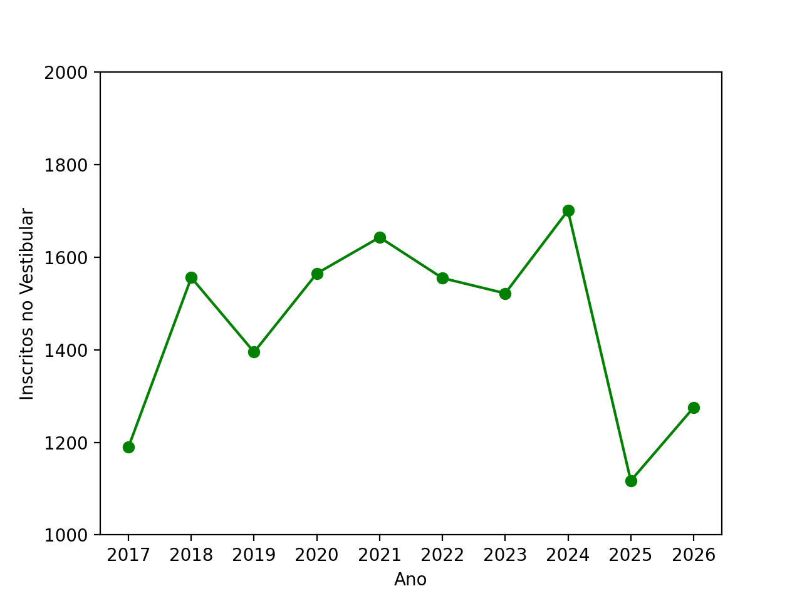

## Procura por cursos da FT

A FT oferece sete cursos de graduação – dois de Tecnologia, três de Engenharia e dois de Bacharelado – em áreas cruciais para a sociedade moderna: Computação, Ambiente, Transportes e Telecomunicações. O gráfico a seguir mostra a evolução do total de inscritos no vestibular Unicamp para os cursos da FT. Podemos perceber um aumento nos inscritos em 2026 em relação a 2025. A FTPA 2025, ocorrida em Julho/2025, antes do fim das inscrições para o vestibular Unicamp em setembro/2025, pode ter contribuído com esse aumento. Uma enquete junto aos alunos ingressantes da FT sobre o efeito da FTPA na escolha pela Unicamp poderia ser realizada para se avaliar o real impacto do evento.

::: {.centerText}
{width=80%}
:::

## Público-alvo

A *FT de Portas Abertas 2026* teve como público-alvo principalmente **jovens que estão cursando o ensino médio** e que estão na fase da escolha de um curso universitário. 

Segundo [dados de 2023](https://qedu.org.br/municipio/3526902-limeira/censo-escolar) do portal de dados educacionais [QEdu](https://qedu.org.br/), Limeira teve mais de **3000** estudantes matriculados na 3^o^ ano do Ensino Médio, sendo 88% em 25 escolas públicas e 12% em 18 escolas particulares. Para esses alunos, a FT de Portas Abertas será uma oportunidade de conhecer cursos de graduação gratuitos e de qualidade, alinhados a áreas de grande relevância no mercado. O primeiro dia do evento, sexta-feira, será especialmente acessível a esse público, permitindo que as escolas organizem visitas institucionais para seus estudantes.

Para essa edição, estabelecemos uma parceria com a Prefeitura de Limeira. A prefeitura forneceu 2 ônibus que foram usados para transportar alunos de duas escolas de Limeira. Esse transporte foi essencial e possibilitou a visitação desses alunos no FTPA 2026.